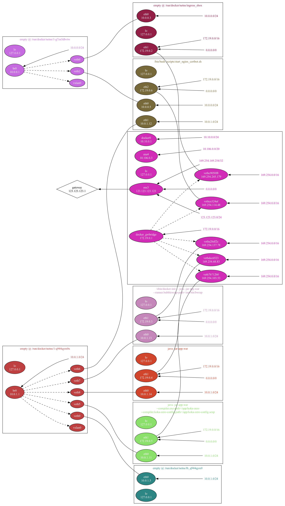

# Network Namespace Visualiser

A tool to render the virtual network inferface connectivity and routing between containers on a remote machine.

Runs `ip` to inspect interfaces and routes, and `lsns` to find network namespaces, then produces a graphviz `dot` graph.

